<h1 align = center> Universus Tourism Frontend (MVC,HTML,CSS,JS,API)</h1>

---

Universus Tourism is a website that was developed for the Web Technologies course at AIUB. In this project, I developed the tourist/traveller frontend using the MVC framework, along with HTML, CSS, JavaScript, API, and MySQL.

---

### **Features of the website include:**

1. Tourists can search manually (flights,hotels,tour) from the homepage.
2. Tourists can sort by price.
3. Tourists can add items to the cart to book or directly book a single product.
4. Tourists can update their profile picture from their respective profile.
5. Tourists can cancel orders, make payments, and check invoices from the order dashboard.
6. Tourists can review their bookings after completing the respective orders.
7. Tourists can use live chat to talk with customer care agents.
8. Tourists can update their profile information from their profile.

---

### API Used:

1. Stripe Payment Gateway (Test Modde).
2. Tawk.to (Live Chat)
3. PHP Mailserver
4. PDF Generation (Invoice)

---

### Project Screenshot:

<h5 align = center>Login & Registration Page</h5>

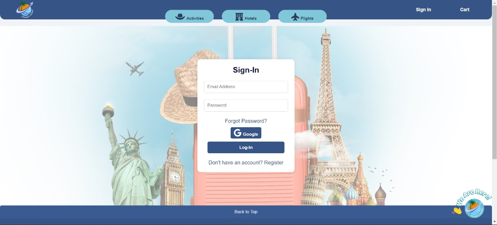

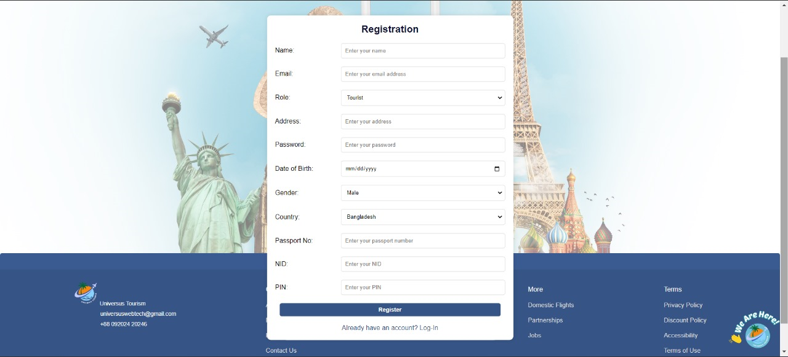

<h5 align = center>Home Page</h5>

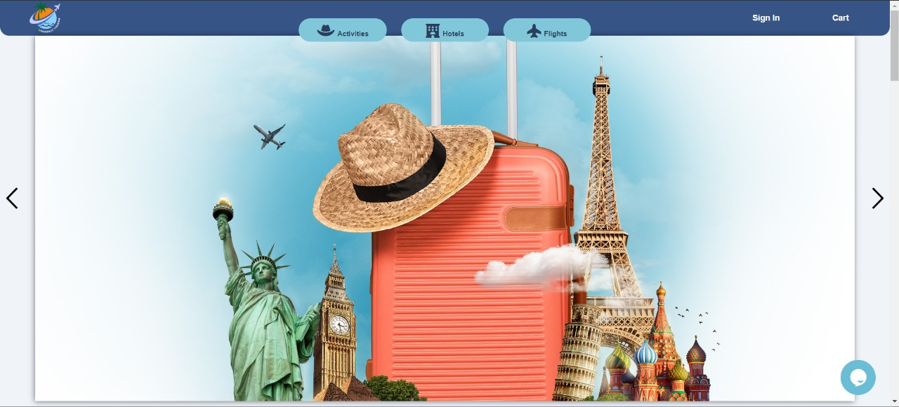

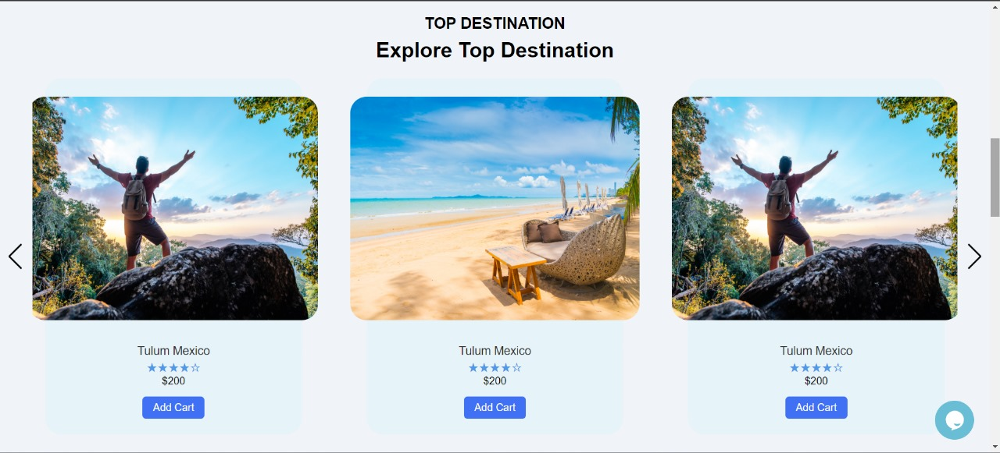

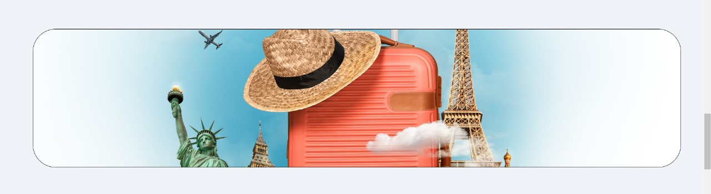

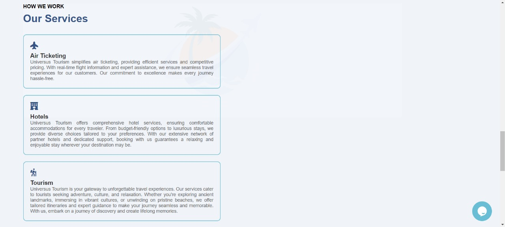

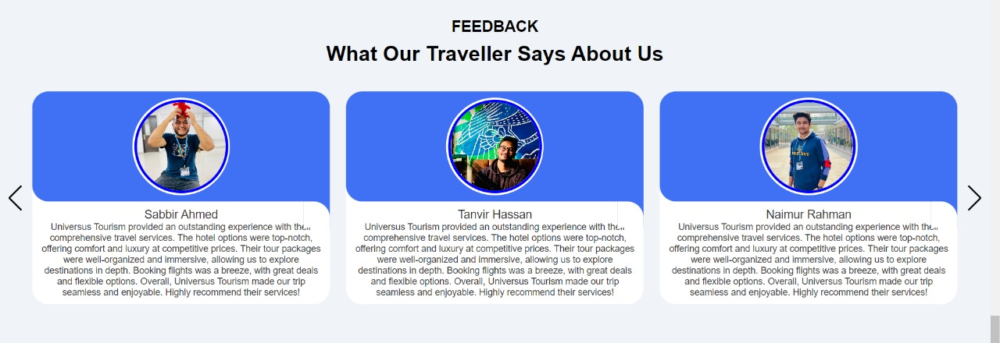

Category Wise Page

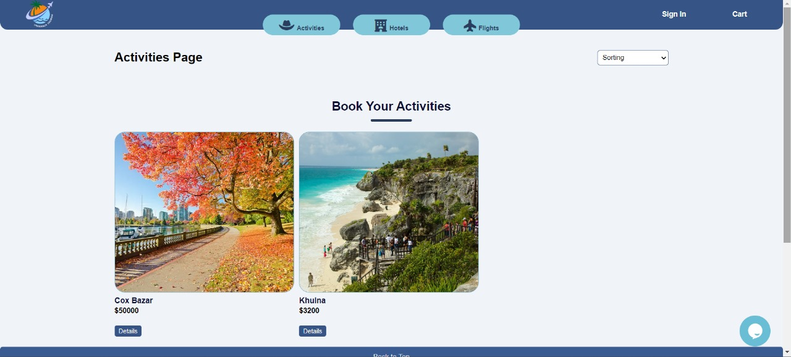

Sort by Price:

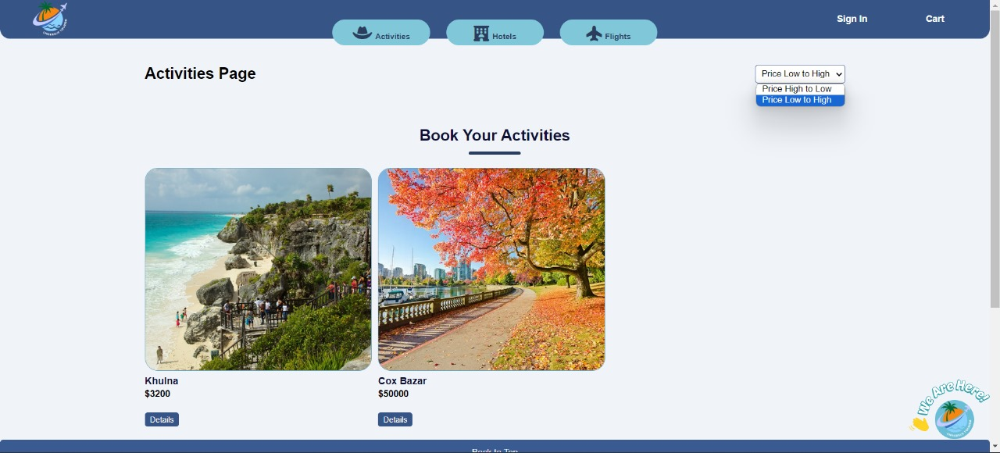

Individual Service Page:

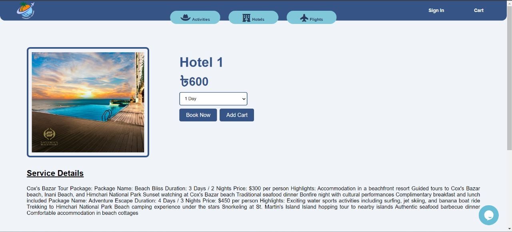

Add to Cart:

Booking Confirmation Page:

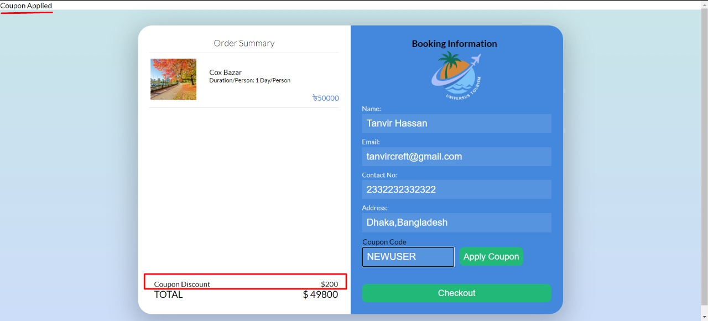

Live Chat With Customer Care: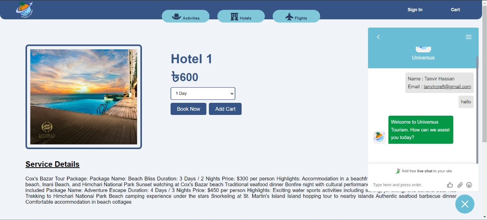

My Profile :

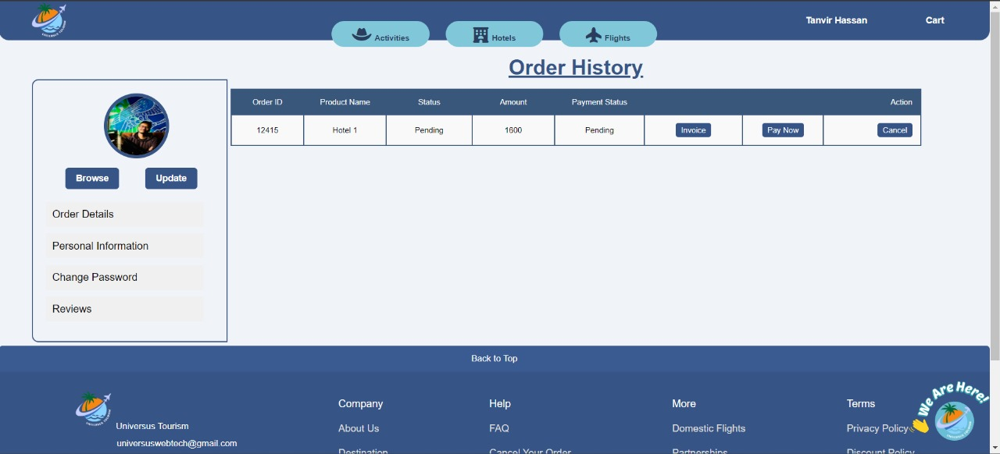

Payment Option: 

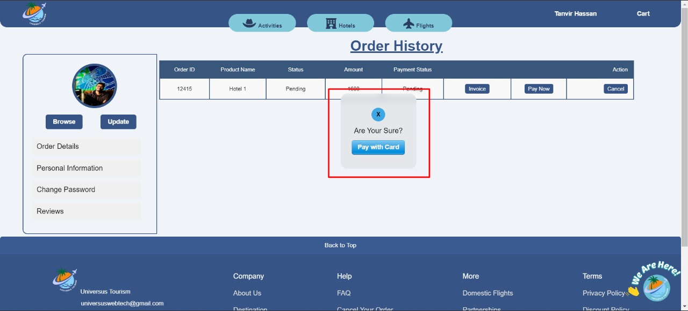

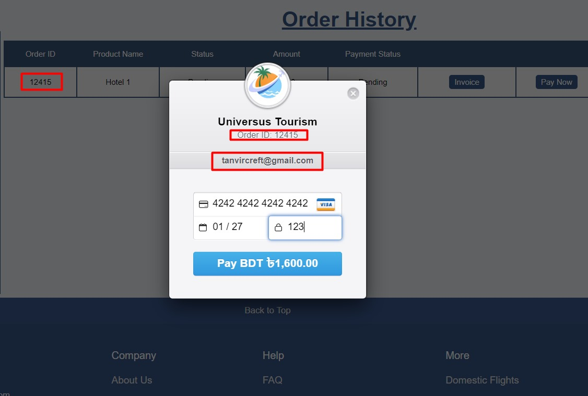

Invoice & Email Option to Registered Email:

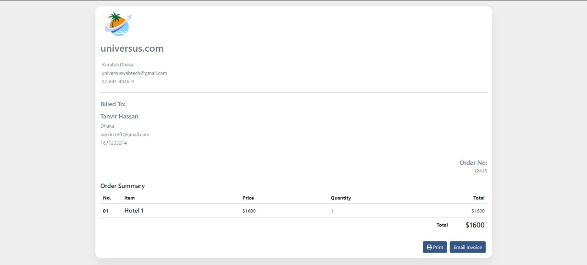

My Profile Sidebar Navigation:

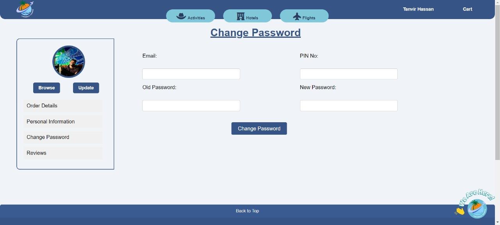

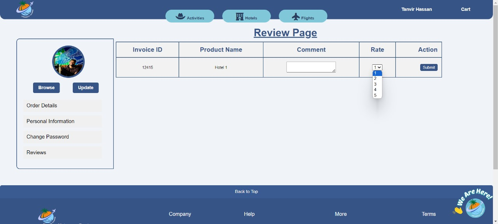
